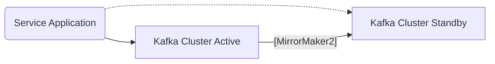
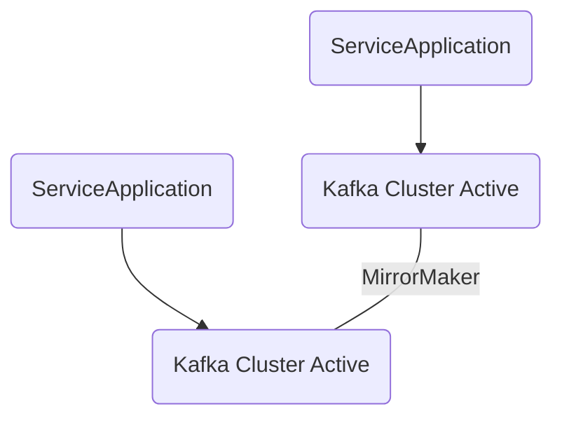
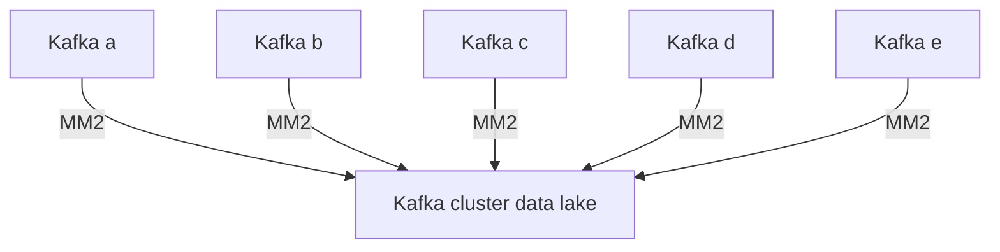

## MirrorMaker 2
카프카 미러메이커 2는 서로 다른 두 개의 카프카 클러스터 간에 토픽을 복제하는 애플리케이션이다. 프로듀서와 컨슈머를 사용해서 직접 미러링하는 애플리케이션을
만들면 되지만 토픽의 모든 것을 복제할 필요성이 있기 때문에 미러메이커를 사용한다. 토픽에 있는 레코드는 고유 메시지 키, 값, 파티션을 가진다. 이를 그대로 옮기는 것은
어렵다. 특히나 동일 파티션에 동일 레코드가 들어가도록 하는 것은 복제 전 클러스터에서 사용하던 파티셔너에 대한 정보 없이는 불가하다. 또한 복제하는 토픽의 파티션 개수가
달라지면 복제된 데이터를 저장하는 토픽의 파티션도 개수가 달라져야하므로 어드민까지 조합한 형태로 개발이 필요하다.


미러 메이커1은 레거시 버전의 미러메이커로 캌프카에서 제공하는 최초의 토픽데이터 복제 기능을 가진 애플리케이션이다. 미러메이커1은 토픽 복제에 있어서 미완성이었다.
토픽 복제에 기본 파티셔너를 사용했기 때문에 복제 전, 후 파티션 정보다 달랐다. 그리고 복제하는 토픽이 달라지면 수정하기 위해서 미러메이커를 재시작했어야 했다. 
또한, 정확히 한 번 전달을 보장하지 못했기에 유실이나 중보깅 발생했다. 카프카 클러스터의 양방향 토픽 복제도 지원하지 못했다.

미러 메이커 2는 토픽의 데이터. 설정까지 복제해서 파티션의 변화, 토픽 설정 값의 변화도 동기화한다. 추가로 커넥터도 사용할 수 있게 설계됐기 때문에 분산 모드 커넥트를
운영한다면 미러메이커2 커넥터를 실행해서 복제할 수 있다.


### 미러메이커2를 활용한 단방향 토픽 복제
```properties
# connector-mirror-maker.properties
clusters = A, B # 클러스터 닉네임

A.bootstrap.servers = A_host1:9092, A_host2:9092, A_host3:9092
B.bootstrap.servers = B_host1:9092, B_host2:9092, B_host3:9092
# 클러스터의 접속 정보


A->B.enabled = true
A->B.topics = .*
B->A.enabled = true
B->A.topics = .*
# 어떤 방향으로 진행할지, 어떤 토픽을 복제할지

replication.factor=1
# 신규 생성된 토픽의 복제 개수를 설정

checkpoints.topic.replication.factor=1
heartbeats.topic.replication.factor=1
offset-syncs.topic.replication.factor=1
offset.storage.replication.factor=1
status.storage.replication.factor=1
config.storage.replication.factor=1
# 토픽 복제에 필요한 데이터를 저장하는 내부 토픽의 복제 개수를 설정

```

```shell
connect-mirror-maker.sh connect-mirror-maker.properties
# 클러스터 A의 test 토픽의 producer로 데이터를 흘리면
kafka-console-producer.sh --bootstrap-server a-kafka:9092 --topic test
# 클러스터 B의 test 토픽의 consumer로 데이터를 확인하면
kafka-console-consumer.sh --bootstrap-server b-kafka:9092 --topic test --from-beginning
```
정상적으로 복제를 확인할 수 있다. 

```shell
kafka-topics.sh --bootstap-server a-kafka:9092 --topic test --alter --partitions 5
kafka-topics.sh --bootstrap-server b-kafka:9092 --topic A.test --describe
```
미러메이커2는 5초마다 폴링하고 동기화한다. 5초 후 확인하면 동기화를 알 수 있다.


### 미러메이커 2를 활용한 지리적 복제(Geo-Replication)
미러메이커로 카프카 클러스터 단위의 활용도를 높일 수 있다. 단,양방향 복제, ACL복제, 새 토픽 자동 감지는 클러스터가 2개 이상 있을 때 진가를 발휘한다.


#### 1. Active-Standby 클러스터 운영
재해 복구용 서버를 두고 운영할 수 있다. 이떄 통신하는 서버를 액티브 클러스터라고 하고 나머지를 스탠바이라고 한다. 미러메이커2로 장애 대응을 할 수 있다.


액티브가 죽더라도 스탠바이가 액티브를 복제하고 있다가 유사시 failOver를 하면 된다. 물론 여기서 복제랙(replication lag)이 발생할 수도 있다.
따라서 이 갭을 어떻게 매울지 고민하고 운영하는 것이 중요하다.

#### 2. Active-Active
통신 지연을 최소화 하기 위해서 2개 이상의 클러스터를 두고 서로 데이터를 미러링 하면서 사용할 수도 있다.


#### Hub and spoke
소규모 카프카 클러스터를 사용하고 있을 때 각 팀의 카프카 클러스터의 데이터를 한 개의 카프카 클러스터에 모아 데이터 레이크로 사용하고 싶다면
허브 앤 스포크 방식의 클러스터 구성이 한 가지 방안이 될 수 있다.


