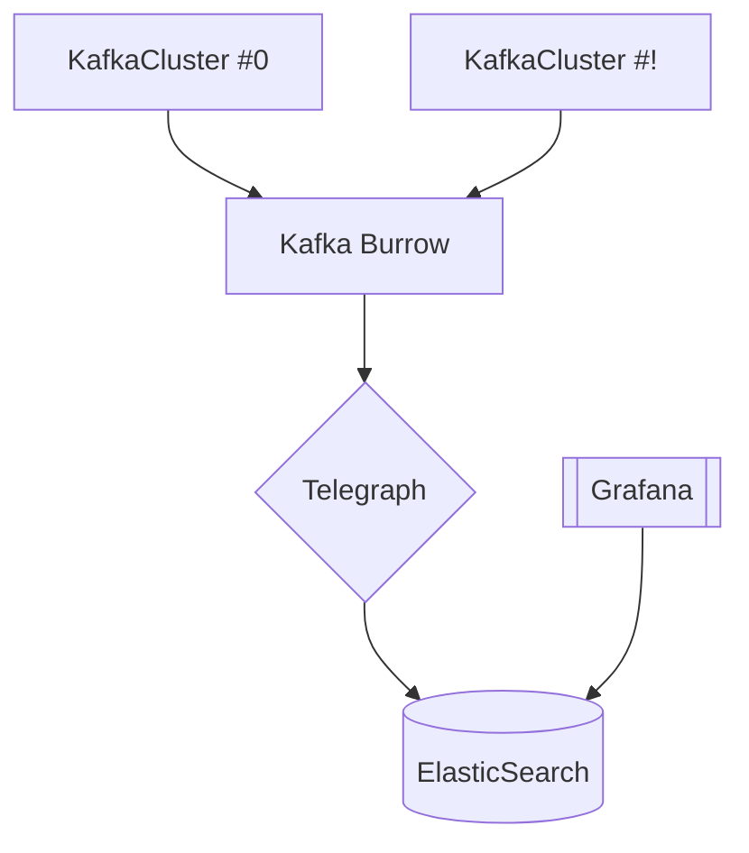

## Topic and Detail
### 4.1 토픽과 파티션
토픽은 카프카 자체다. 토픽을 만들며 시작하고 토픽을 삭제하면 데이터가 삭제되고 파이프라인이 중단된다. 그만큼 토픽은 중요한 역할을 한다.

#### 적정 파티션 개수
파티션 개수는 카프카 성능과 관련이 있다. 그렇기 때문에 토픽을 운영함에 있어 적절한 파티션 개수를 설정하고 운영하는 것이 중요하다. 고려할 점은 아래와 같다.
1. 데이터 처리량
2. 메시지 키 사용 여부
3. 브로커, 컨슈머 영향도

파티션은 카프카 병렬처리의 핵심이다. 파티션 개수가 많아지면 1:1 매핑되는 컨슈머가 들기 때문이다. 그렇기에 토픽의 파티션 개수는 데이터 처리량을 측정해서 정하는 것이 합리적이다. 
데이터 처리 속도를 올리는 방법은 1. 컨슈머 처리량을 늘리거나 2. 컨슈머를 추가해서 병렬 처리량을 늘리는 것이다.
반면 파티션 개수를 늘리고 파티션 개수만큼 컨슈머를 추가하는 방법은 데이터 처리량을 늘리는 가장 확실한 방법이다 .

> 프로듀서 전송 데이터량 < 컨슈머 데이터 처리량 * 파티션 개수

파티션 개수만큼 컨슈머 쓰레드를 운영하면 병렬처리를 극대화할 수 있다. 만약 전체 컨슈머 데이터 처리량이 프로듀서가 보내는 데이터보다 적다면 컨슈머 랙이 생기고 데이터 처리 지연이 발생한다.(이는 로직 시간 복잡도를 줄이는 것이 중요하단 소리가 된다.)
물론 파티션 개수를 무조건 늘리는게 능사는 아니다. 파티션 개수를 늘리면 컨슈머, 브로커 부담이 있기 떄문이다. 그렇기 때문에 데이터를 처리함에 있어서 지연 발생에 따른
서비스 영향도를 같이 고려하여 파티션 개수를 구하는 것이 중요하다. 

다음으로 메시지 키 사용 여부를 정하는 것이다. 메시지키 사용 여부는 데이터 처리 순서와 밀접한 연관이 있다. 프로듀서가 기본 파티셔너를 사용할 경우 메시지 키를 사용하면
프로듀서가 토픽으로 데이터를 보낼 때 메시지 키를 해시 변환해서 메시지를 파티션에 매칭시킨다. 만약 파티션 개수가 달라지면 이미 매칭된 파티션과 메시지 키의
매칭이 깨지고 파티션-메시지 키 매칭이 깨진다. 이러면 특정 메시지 키의 순서를 보장받기가 어려워진다. 

메시지 키를 사용하고 컨슈머에서 순서보장이 필요하다면 최대한 파티션 변화를 주지 말아야 한다. 만약에 파티션 변경이 불가피하다면
기존 메시지 키의 매칭을 그대로 가져가기 위해서 파티셔너를 커스텀해야 한다. 이런 문제 때문에 키 별로 처리 순서를 보장하기 위해서는
프로듀서가 전송하는 데이터 양보다 파티션 개수를 넉넉하게 잡는 것이 좋다. 순서 보장이 필요 없다면 그냥 데이터 양에 맞춰서 줄이고 늘리면 된다.

마지막으로 고려할 점은 브로커와 컨슈머의 영향도다. 카프카에서 파티션은 각 브로커의 파일 시스템을 사용한다. 그렇기에 파티션이 늘면
브로커에서 접근하는 파일 개수가 늘어난다. OS는 프로세스 당 열 수 있는 파일 최대 개수를 제한하고 있다. 그러므로 카프카 브로커가
접근하는 파일 개수를 안정적으로 유지하기 위해서 브로커당 파티션 개수를 모니터링 해야한다. 파티션 개수가 너무 많으면 분산도 답이다.

#### 토픽 정리 정책(cleanup.policy)
토픽 데이터는 시간 또는 용량에 따라 삭제 규칙을 적용할 수 있다. 또는 삭제를 원하지 않는다면 카프카 클러스와 토픽의 데이터 생명주기를 같이 할 수도 있다.
데이터가 남아 있으면 필요할 때 오프셋을 지정해서 일주일, 한 달 이상이 지난 데이터도 가져올 수 있다.

그러나 운영 비용에 문제가 생길 수도 있다. 따라서 데이터를 더 이상 사용하지 않을 경우에는 `cleanup.policy`로 데이터를 삭제할 수 있는데 옵션은 2가지다. 첫 번째는 
delete로 완전 삭제, 두 번쨰는 compact로 동일 메시지 키의 가장 오래된 데이터를 삭제하는 방법이다.

1. delete policy
토픽의 데이터를 삭제할 때는 세그먼트 단위로 삭제를 진행한다. 세그먼트는 토픽의 데이터를 저장하는 명시적인 파일 시스템 단위다. 세그먼트는 파티션마다 별개로 생성되며 세그먼트의
파일 이름은 오프셋 중 가장 작은 값이 된다. 세그먼트는 여러 조각으로 나뉘는데 segment.bytes 옵션으로 1개의 세그먼트 크기를 정할 수 있다. segment.bytes 크기보다
커질 경우에는 기존에 적재하던 세그먼트 파일을 닫고 새로운 세그먼트를 열어서 데이터를 저장한다. 데이터를 저장하기 위해 사용 중인 세그먼트를 액티브 세그먼트라고 한다.
`retention.ms` 토픽의 데이터 유지 기간을 밀리 초로 설정할 수 있는 키 값이다. `retention.bytes`는 토픽의 최대 사이즈를 정의하는 키 값이다.

2. compact policy
압축이란 메시지 키별로 해당 메시지 키의 레코드 중 오래된 데이터를 삭제하는 정책을 의미한다. 메시지 키를 기준으로 오래된 데이터를 삭제하기 때문에 삭제 정책과 다르게
1개 파티션에서 오프셋 증가가 일정하지 않을 수 있다. 

특히 토픽 압축 정책은 카프카 스트림즈의 KTable과 같이 메시지 키를 기반으로 데이터를 처리할 경우 유용하게 작용할 수 있다. 데이터의 흐름이 아닌 가장 마지막으로 
업데이트된 메시지 키의 데이터가 중요할 경우 최신 데이터 이외에는 다 삭제할 수 있기 떄문이다. 

|  오프셋  |  0   |  1  |  2  |  3  | 4 |  5  |  6  |
|:-----:|:----:|:---:|:---:|:---:|:---:|:---:|:---:|
|  Key  |  K1  | K2  | K3  | K3  |K1   | K2  | K1  |
| Value |  V1  | V1     |V1      | V2  |V2   | V2    | V3  |

⬇

|  오프셋  |  0  |  1  |  2  |
|:-----:|:---:|:---:|:---:|
|  Key  | K3  | K2  | K1  |
| Value | V2  | V2  | V1  |

압축 정책은 액티브 세그먼트를 제ㅚ한 나머지 세그먼트들에 한해서만 데이터를 처리한다. `min.cleanable.dirty.ratio`
으로 압축 시점을 가른다. 이 옵션은 액티브 세그먼트를 제외한 세그먼트에 남아 있는 데이터의 tail 영역 레코드 수와 head 영역의 레코드 개수 비율을 뜻한다. 테일 영역의
레코드들은 `clean log`라고 부르고 압축이 완료됐기 때문에 tail에는 중복된 메시지 키가 없다. head는 압축 전 레코드들이 있으므로 중복된 메시지 키를 가진 레코드들이 있다. 

|  오프셋  |  0   |  1  |  2  |  3  | 4 |  5  |  6  |
|:-----:|:----:|:---:|:---:|:---:|:---:|:---:|:---:|
|  Key  |  K1  | K2  | K3  | K3  |K1   | K2  | K1  |
| Value |  V1  | V1     |V1      | V2  |V2   | V2    | V3  |

>
> 0 ~ 2 클린 레코드 (3)
> 3 ~ 5 더티 레코드 (3)
> 6 액티브 세그먼트
> 
> dirty / (clean + dirty)
> = 0.5
> 
`min.cleanable.dirty.ratio`가 너무 크면 압축을 한 번에 수행하지만 용량에 부담이 될 거고 
반대라면 너무 자주 일어나서 CPU에 부담이 될 것이다. 


#### ISR(In-Sync-Replicas)
ISR은 리더 파티션과 팔로워 파티션이 모두 싱크가 된 상태를 의미한다. 복제 개수가 2인 토픽을 보자. 이 토픽에는
리더 1, 팔로워 1이 존재할거다. 자 팔로워가 리더에 싱크를 맞추는데 시간 차가 존재한다. 그럼 결국 리더, 팔로워 간 오프셋 차가 발생한다. 
이런 차이를 모니터링하기 위해서 리더 파티션은 `replica.lag.time.max.ms` 값만큼 주기를 가지고 팔로워 파티션이 데이터를 복제하는지 확인한다.
만약 팔로워 파티션이 해당 값을 넘을 때까지 데이터를 가져가지 않으면 문제가 생긴것으로 판단, `ISR 그룹`에서 제외한다. (redis centinel의 정족수 계산이랑 비슷한 느낌 같다.)

ISR로 묶인 리더, 팔로워는 파티션에 존재하는 데이터가 모두 동일하기에 팔로워는 리더로 승격될 수도 있다. 반면, ISR에서 퇴출되면 리더가 될 수 없다.
데이터 유실이 상관 없다면 ISR이 아닌 파티션을 리더로 선출할 수도 있다. `unclean.leader.election.enable`을 `true`로 두면 된다. 
`false`로 두면 이 경우에는 리더 파티션이 존재하는 브로커가 다시 시작되기까지 기다린다. 곧 서비스 중단을 의미한다. `true`로 두면 동기화되지 않은 데이터가 유실될 수 있다. 
대신 서비스 중단은 발생하지 않는다.

이 옵션은 정책적으로 무중단 운영이 중요한지 아니면 데이터가 유실이 중요한지에 따라 달라질 것이다. false로 두면 이슈가 발생한 브로커가 다시 실행될 때까지 기다려야 하므로
중단이 생길 수 있다. 이 옵션은 토픽별로 설정할 수 있으며
```shell
/bin/kafka-topics.sh \
--create \
--bootstrap-server localhost:9092 \
--topic test-topic \
--config unclean.leader.election.enable=false
```

### 4.2프로듀서

#### acks 옵션 
acks는 0,1,all(-1)을 가질 수 있다. 이 옵션으로 프로듀서가 전송한 데이터가 카프카 클러스터에 얼마나 신뢰성 높게 저장할지 지정할 수 있다. 그리고 acks 옵션이 따라
성능이 달라질 수도 있다. 복제 개수가 1이면 크게 다른점이 없기에 복제 개수가 2일 때를 기준으로 살펴보자.

##### acks=0
acks를 0으로 설정하면 프로듀서가 리더 파티션으로 데이터를 전송했을 때 리더 파티션으로 데이터가 저장됐는지 확인하지 않는다는 뜻이다. 리더 파티션은 데이터가 저장된 
이후에 데이터가 몇 번쨰 오프셋에 저장됐는지 리턴하는데 0으로 설정되어 있으면 프로듀서는 리더 파티션에 데이터가 저장됐는지 관심이 없다. 이는 나중에 데이터가 몇 번쨰 
오프셋에 저장됐는지 확인할 수 없는 상황을 만들 수도 있다.

전송 실패시 retry를 하도록 옵션을 설정할 수 있는데 acks가 0이면 성공 여부를 알 길이 없어서 retries 옵션을 무시하는 결과를 낳는다. 물론 acks가 0일 때 네트워크
오류, 브로커 이슈 등이 발생해도 신경쓰지 않는다. 대신 1, -1보다 훨씬 빠르다.

##### acks=1
리더 파티션에만 정상적으로 적재됐는지 확인한다. 만약 리더가 제대로 받지 못했다면 받을 때까지 retry 할 수도 있다. 리더에 적재됐더라도 
데이터 유실이 있을 수도 있는데 복제 개수를 2 이상으로 하면 팔로워가 동기화를 하지 못했을 수도 있다. 이 경우 리더가 장애에 빠지면 데이터 유실로 직결된다. 

##### acks=-1 or acks=all
all, -1은 리더, 팔로워 모두를 체크한다. 그러다 보니 0, 1보다 훨씬 느리다. 그럼에도 불구하고 데이터 유실을 걱정할 일이 없어진다. all로 설정한 경우 `min.insync.replicas`
옵션에 따라서 데이터 안정성이 달라진다. ISR에 포함된 파티션을 대상으로 데이터 적재를 확인하는 최소 개수를 정하는 키 값이다. `min.insync.replicas`이 1이면
ISR 중 최소 1개 이상 파티션에 데이터가 적재됐음을 보증한다. 이 경우 acks=1과 같다. ISR에서 최초 데이터 적재는 리더에서 발생하기 때문이다.
`min.insync.replicas`를 2로 했을 때부터 의미가 있어지는 값이다. 추가적으로 `min.insync.replicas`가 복제 개수보다 작으면 문제가 된다. 같아도 장애에 빠진 경우를
고려하면 현명하지 못한 선택이 될 가능성이 매우 높다. 


#### 멱등성(idempotence) 프로듀서
멱등성은 여러 번 연산을 수행하더라도 동일한 결과를 나타내는 것을 의미한다. 이는 멱등성 프로듀서는 동일한 데이터를 여러 번 전송하더라도 카프카 클러스터에
한 번만 저장됨을 의미한다. 기본  프로듀서 동작은 `at least once delivery`이다. 적어도 한 번 전달이란 프로듀서가 클러스터에 데이터를 전송하여 저장할 때
적어도 한 번 이상 데이터를 적재할 수 있고 데이터가 유실되지 않음을 의미한다. 즉 두 번 이상 저장할 수 있다는 뜻이다.

0.11.0 이후로는 프로듀서에서 `enable.idempotence` 옵션으로 딱 한 번만 전달할 수 있도록 할 수 있다. 멱등성 프로듀서는 기본 프로듀서와 달리
데이터를 브로커로 전달할 때 프로듀서 PID와 시퀀스 번호를 함께 전달한다 그러면 브로커는 프로듀서의 PID, 시퀀스 넘버를 확인해서 동일한 메시지
적재 요청이 오면 한 번만 적재한다. 

단, 멱등성 프로듀서는 동일 세션에만 정확히 한 번 전달을 보장한다. 동일 세션이란 PID의 생명 주기를 뜻한다. 만약 멱등성 프로듀서로 동작하는
프로듀서 애플리케이션에 이슈가 생겨서 종료되고 재시작하면 PID가 달라지므로 이 경우는 한 번을 보장할 수 없다. 

`enable.idempotnece`를 true로 주면 `한 번`을 보장하기 위해서 일부 옵션들이 강제된다. retries는 Integer.MAX_VALUE가 되고 acks는 all가 된다. 
이렇게 강제되는 이유는 프로듀서가 적어도 한 번 이상 브로커에 데이터를 보냄으로써 브로커에 단 한 번만 데이터가 적재되는 것을 보장하기 위해서다. 멱등성 프로듀서는
정확히 한 번 보내기 위해 진짜로 한 번만 보내는 것이 아니라 상황에 따라 여러 번 전송하되, 브로커가 여러 번 전송된 데이터를 확인하고 중복을 거르는 것이다. 

#### 트랜잭션(transaction) 프로듀서
카프카의 트랜잭션 프로듀서는 다수의 파티션에 데이터를 저장할 경우 모든 데이터에 동일한 원자성(atomic)을 만족시키기 위해서 사용한다. 원자성을 만족시킨다는 의미는
다수의 데이터를 동일 트랜잭션으로 묶음으로써 전체 데이터를 처리하거나 전체 데이터를 처리하지 않도록 하는 것을 의미한다. 컨슈머는 기본적으로 프로듀서가 보내는 데이터가
파티션에 쌓이는 대로 모두 가져가서 처리한다. 그러나 트랜잭션으로 묶인 데이터를 브로커에 가져갈 때는 다르게 동작하도록 설정할 수 있다.
`enable.idempotence`를 true를 주고 `transaction.id`를 임의의 String으로 설정한다. 그리고 컨슈머 `isolation.level`을 `read_committed`로
설정하면 프로듀서와 컨슈머는 트랜잭션으로 완료된 데이터만 쓰고 읽는다. 

트랜잭션은 파티션의 레코드로 구분한다. 트랜잭션 프로듀서는 사용자가 보낸 데이터를 레코드로 파티션에 저장할 뿐만 아니라 트랜잭션 시작 - 끝 표현을 위해서 트랜잭션
레코드를 한 개 더 보낸다. 트랜잭션 컨슈머는 트랜잭션 레코드를 보고 commit 됐음을 확인하고 데이터를 가져간다. 트랜잭션 레코드는 트랜잭션 상태를 표시하는 정보만 가진다.
대신 레코드의 특성을 그대로이기 때문에 파티션에 저장되어 오프셋 하나를 차지한다. 트랜잭션 컨슈머는 커밋이 완료된 데이터가 파티션에 있을 경우만 데이터를 가져간다.
만약 데이터만 존재하고 트랜잭션 레코드가 존재하지 않으면 아직 트랜잭션이 완료되지 않았다고 판단하고 데이터를 가져가지 않는다. 

### 4.3 카프카 컨슈머
컨슈머는 카프카에 적재된 데이터를 처리한다. 컨슈머를 통해 데이터를 카프카 클러스터로부터 가져가고 처리해야 한다. 

#### 멀티 쓰레드 컨슈머
카프카는 처리량을 늘리기 위해 파티션과 컨슈머 개수를 늘려서 운영할 수 있다. 파티션을 여러 개로 운영하는 경우 데이터를 병렬처리하기 위해서 파티션 개수와 컨슈머 개수를
동일하게 맞추는 방법이 좋은 방법이다. 토픽의 파티션은 1개 이상으로 이뤄져있으며 1개의 파티션은 1개 컨슈머가 할당되어 데이터를 처리할 수 있다. 파티션이 n개면
동일 컨슈머 그룹으로 묶인 컨슈머 쓰레드를 최대 n개 운영할 수 있다. 그러므로 n개 쓰레드를 가진 1개의 프로세스를 운영하거나 1개의 쓰레드를 가진 프로세스를 n개 운영하는 방법도 있다.

물론 선택이다. 멀티 쓰레드/ 멀티 프로세스는 말이다. 멀티쓰레드로 컨슈머를 안전하게 운영하기 위해서는 고려해야 할 부분이 많다. 우선, 멀티 쓰레드 애플리케이션으로 
개발할 경우 하나의 프로세스 내부에 쓰레드가 여러 생성되어 실행되기 때문에 하나의 컨슈머 쓰레드에서 예외 (OutOfMemory 등)가 발생할 경우 프로세스 자체가 종료될 수 있고
이는 다른 컨슈머 쓰레드까지 영향을 미칠 수 있다. 컨슈머 쓰레드들이 비정상적으로 종료될 경우 데이터 처리에서 중복 또는 유실이 발생할 수 있기 때문이다. 또한, 각 컨슈머
쓰레드 간 영향을 미치 않도록 쓰레드 세이프 로직, 변수를 적용해야 한다. 고려할 점이 많지만, 멀티 쓰레드로 동작하는 멀티 컨슈머 쓰레드 애플리케이션을 안정적으로 
지속 운영할 수 있도록 개발한다면 매우 효율적으로 컨슈머를 운영할 수 있다.

제한된 리소스 속에서 멀키 컨슈머 쓰레드를 운영하면 최대의 성능을 발휘할 수 있기 때문에 컨슈머를 멀티 쓰레드로 활용하는 방식은 크게 두 가지로 나뉜다.
1. 컨슈머 쓰레드는 1개로 하고 데이터 처리를 담당하는 워커 쓰레드(worker thread)는 여러 개 실행하는 방법인 멀티 워커 전략
2. 컨슈머 인스턴스에서 poll() 메소드를 호출하는 쓰레드를 여러 개 띄워서 사용하는 멀티 쓰레드 전략이다.

##### 멀티 워커 쓰레드 전략
브로커로부터 전달받은 레코드들을 병렬로 처리한다면 1개의 컨슈머 쓰레드로 받은 데이터를 더욱 향상된 속도로 처리할 수 있다. 멀티 쓰레드를 생성하는 `ExecutorService`
를 사용하면 레코드를 병렬처리하는 쓰레드를 효율적으로 생성하고 관리할 수 있다. Executors를 사용하여 쓰레드 개수를 제어하는 `ThreadPool`을 생성할 수 있는데,
데이터 처리 환경에 맞는 쓰레드 풀을 사용하면 된다. 작업 이후 쓰레드가 종료되어야 한다면 `CacheThreadPool`을 사용하여 쓰레드를 실행한다.

[ConsumerWorker](/multiThreadConsumer/src/main/java/multiWorker/ConsumerWorker.java)
[Consumer](/multiThreadConsumer/src/main/java/multiWorker/Consumer.java)
```java
public class ConsumerWorker implements Runnable {

    private final static Logger logger = LoggerFactory.getLogger(ConsumerWorker.class);
    private String recordValue;

    public ConsumerWorker(String recordValue) {
        this.recordValue = recordValue;
    }

    @Override
    public void run() {
        logger.info("thread {}\trecord {}", Thread.currentThread().getName(), recordValue);
    }
}


public class Consumer {
    private final static Logger logger = LoggerFactory.getLogger(Consumer.class);
    private final static String TOPIC_NAME = "test";
    private final static String BOOTSTRAP_SERVER = "192.168.0.11:9092";
    private final static String GROUP_ID = "test-group";

    public static void main(String[] args) {
        Properties config = new Properties();
        config.put(ConsumerConfig.BOOTSTRAP_SERVERS_CONFIG, BOOTSTRAP_SERVER);
        config.put(ConsumerConfig.GROUP_ID_CONFIG, GROUP_ID);
        config.put(ConsumerConfig.KEY_DESERIALIZER_CLASS_CONFIG, StringDeserializer.class.getName());
        config.put(ConsumerConfig.VALUE_DESERIALIZER_CLASS_CONFIG, StringDeserializer.class.getName());

        KafkaConsumer<String, String> consumer = new KafkaConsumer<String, String>(config);
        consumer.subscribe(Arrays.asList(TOPIC_NAME));

        ExecutorService executorService = Executors.newCachedThreadPool();

        Set<TopicPartition> assignedTopicPartition = consumer.assignment();
        logger.error("ASSIGNMENT {}", assignedTopicPartition);


        while ( true ) {
            ConsumerRecords<String , String > records = consumer.poll(Duration.ofSeconds(1));

            for ( ConsumerRecord<String, String> record: records) {
                ConsumerWorker worker = new ConsumerWorker(record.value());
                executorService.execute(worker);
            }
        }


    }
}
```

poll() 메소드로 리턴받은 레코드들을 처리하는 쓰레드를 레코드마다 개별 실행한다. 이와 같이 데이터를 병렬처리함으로써 속도의 이점을 확실히 얻을 수 있다. 그러나
첫 번째는 쓰레드를 사용함으로써 데이터 처리가 끝나지 않았음에도 커밋을하기에 리밸런싱, 컨슈머 장애시 데이터 유출이 생길 수 있다. 위 코드는 데이터 처리가 끝났음을 쓰레드로부터
리텉 받지 않고 poll()을 호출한다. 오토 커밋인 경우 데이터 처리가 쓰레드에서 진행 중임에도 poll()을 하면 발생할 수 있는 현상이다.

두 번째는 레코드 처리 역전 현상이다. for로 쓰레드를 생성하므로 레코드별로 쓰레드 생성은 순차적이다. 그러나 동작 완료는 순서대로라고 할 수 없다. 따라서 순서가
상관 없는 경우에 적합하다. 


##### 멀티 쓰레드 전략
하나의 파티션은 동일 컨슈머 중 최대 1개까지 할당된다. 그리고 하나의 컨슈머는 여러 파티션에 할당될 수 있다. 이런 특징을 가장 잘 살리는 방법은 1개의 애플리케이션에
구독하고자 하는 토픽의 파티션 개수만큼 컨슈머 쓰레드 개수를 늘려서 운영하는 것이다. 컨슈머 쓰레드를 늘려서 운영하면 각 쓰레드에 각 파티션에 할당되며, 파티션의 레코드들을 병렬 처리할 수 있다.

주의할 부분은 구독하고자하는 토픽의 파티션 개수만큼 컨슈머 쓰레드를 운영하는 것이다. 컨슈머 쓰레드가 파티션 개수보다 많아지면 할당할 파티션 개수가 더는 없으므로 파티션에
할당되지 못한 컨슈머 쓰레드는 데이터 처리를 하지 않게 된다.

```java
public class ConsumerWorker implements Runnable {

    private final static Logger logger = LoggerFactory.getLogger(ConsumerWorker.class);
    private Properties properties;
    private String topic;
    private String threadName;
    private KafkaConsumer<String, String> consumer;
    // ThreadSafe하지 않다. 따라서 Thread 별로 만들어서 운영해야 한다.
    // 만약 그렇지 않으면 ConcurrentModificationException이 난다.

    public ConsumerWorker(Properties properties, String topic, int number) {
        this.properties = properties;
        this.topic = topic;
        this.threadName = String.format("consumer-thread-%d", number);
    }

    @Override
    public void run() {
        consumer = new KafkaConsumer<String, String>(properties);
        consumer.subscribe(Arrays.asList(topic));
        // 생성자 변수로 받은 토픽을 명시적으로 구독

        while( true ) {
            ConsumerRecords<String, String> records = consumer.poll(Duration.ofSeconds(1));
            for( ConsumerRecord<String, String> record : records ) logger.info("{}", record);
        }

    }
}


public class MultiConsumerThread {
    private final static String TOPIC_NAME = "test";
    private final static String BOOTSTRAP_SERVER = "192.168.0.11:9092";
    private final static String GROUP_ID = "test-group";
    private final static int CONSUMER_COUNT = 3;

    public static void main(String[] args) {
        Properties config = new Properties();
        config.put(ConsumerConfig.BOOTSTRAP_SERVERS_CONFIG, BOOTSTRAP_SERVER);
        config.put(ConsumerConfig.GROUP_ID_CONFIG, GROUP_ID);
        config.put(ConsumerConfig.KEY_DESERIALIZER_CLASS_CONFIG, StringDeserializer.class.getName());
        config.put(ConsumerConfig.VALUE_DESERIALIZER_CLASS_CONFIG, StringDeserializer.class.getName());

        ExecutorService executorService = Executors.newCachedThreadPool();
        for ( int i = 0; i < CONSUMER_COUNT; i ++ ) {
            ConsumerWorker worker = new ConsumerWorker(config, TOPIC_NAME, i);
            executorService.execute(worker);
        }
    }
}
```

#### 컨슈머 랙
컨슈머 랙은 토픽의 최신 오프셋(LOG-END-OFFSET)과 컨슈머 오프셋(CURRENT_OFFSET) 간의 차이다. 프로듀서는 계속해서 새로운 데이터를 파티션에 저장하고 컨슈머는
자신이 처리할 수 있는 만큼 데이터를 가져간다. 컨슈머 랙은 컨슈머가 정상 동작하는지 여부를 확인할 수 있기 때문에 컨슈머 애플리케이션을 운영한다면 필수적으로 모니터링해야 하는 지표다.

컨슈머 랙은 컨슈머 그룹과 토픽, 파티션별로 생성된다. 1개의 토픽에 3개의 파티션이 있고 1개의 컨슈머 그룹이 토픽을 구독하여 데이터를 가져가면 컨슈머 랙은 총 3개가 된다. 
프로듀서가 보내는 데이터 양이 컨슈머의 데이터 처리량보다 크다면 컨슈머 랙은 늘어난다. 반대로 프로듀서가 보내는 데이터 양이 컨슈머의 데이터 처리량보다 적으면 컨슈머 랙은 줄어들고
최소 값은 0으로 지연이 없음을 뜻한다.

컨슈머 랙을 모니터링하는 것은 카프카를 통한 데이터 파이프라인을 운영하는 데에 핵심적인 역할을 한다. 컨슈머 랙을 모니터링함으로써 컨슈머의 장애를 확인할 수 있고 파티션
개수를 정하는 데에 참고할 수 있기 때문이다. 이 경우 일시적으로 지연을 줄이기 위해서 파티션 개수와 컨슈머 개수를 늘려서 병렬처리량을 늘릴 수 있다.
프로듀서의 데이터 양이 일정함에도 컨슈머 장애로 컨슈머 랙이 증가할 수도 있다. 이 경우 보통 컨슈머에 이슈가 발생했음을 유추할 수 있다.

컨슈머 랙을 확인하는 방법은 총 3가지가 있다. 1. 카프카 명령어 사용, 2. 컨슈머 애플리케이션에서 `metrics()` 메소드를 사용, 3. 외부 모니터링 툴을 사용

##### 1. 카프카 명령어 사용하여 컨슈머 랙 조회
`kafka-consumer-group.sh`를 사용하면 컨슈머 랙을 포함한 특정 컨슈머 그룹의 상태를 확인할 수 있다. 
```shell
/bin/kafka-consumer-groups.sh \
--bootstrap-server localhost:9092 \
--group [group] \
--describe
```
이 명령어로 `[group]`에 해당하는 컨슈머 그룹이 토픽을 구독하는 상태를 확인할 수 있다. 파티션 개수 만큼 컨슈머 랙을 확인할 수 있으며, `LOG-END-OFFSET` 항목으로ㅓ
컨슈머 랙이 발생하고 있다는 사실을 확인할 수 있다. 단, 이 방법은 일회성에 그치고 지속적으로 기록하고 모니터링하기에는 부족하다. 

##### 2. `metrics()` 메소드를 사용하여 컨슈머 랙 조회
`KafkaConsumer`의 `metrics()` 메소드를 활용하면 컨슈머 랙 지표를 확인할 수 있다. 컨슈머 랙 관련 모니터링 지표는 `records-lag-max`, `records-lag`, `records-lag-avg`가 있다.

```java
import java.util.Map;

class ConsumerMatrixWorker implements Runnable {

    private final static Logger logger = LoggerFactory.getLogger(ConsumerWorker.class);
    private Properties properties;
    private String topic;
    private String threadName;
    private KafkaConsumer<String, String> consumer;

    @Override
    public void run() {
        consumer = new KafkaConsumer<String, String>(properties);
        consumer.subscribe(Arrays.asList(topic));
        // 생성자 변수로 받은 토픽을 명시적으로 구독

        while (true) {
            ConsumerRecords<String, String> records = consumer.poll(Duration.ofSeconds(1));
            for (ConsumerRecord<String, String> record : records) logger.info("{}", record);
            for (Map.Entry<MetricName, ? extends  Metric> entry : consumer.metrics().entrySet() ) {
                if( 
                    "records-lag-max".equals(entry.getKey().name()) ||
                    "records-lag".equals(entry.getKey().name()) ||
                    "records-lag-avg".equals(entry.getKey().name())
                ) {
                   Metric metric = entry.getValue();
                   logger.info("{}: {}", entry.getKey().name(), metric.metricValue());
                }
            }
        }
    }

}
```

이러면 3가지 문제점이 있다.
1. 컨슈머가 정상 동작할 때만 확인할 수 있다. `metric()`이 정상 실행되어야만 확인할 수 있다. 비정상 동작을 하면 확인할 수 없다.
2. 모든 컨슈머 애플리케이션에 컨슈머 랙 모니터링 코드를 반복 작성해야 한다. 특정 컨슈머 그룹에 해당하는 애플리케이션이 수집하는 컨슈머 랙은 자기 자신 컨슈머 그룹에 대한 컨슈머 랙만 한정되기 때문이다.
3. 컨슈머 랙을 모니터링하는 코드를 추가할 수 없는 카프카 서드 파티 애플리케이션은 모니터링이 불가능하다. 

##### 3. 외부 모니터링 툴 사용
데이터 독(Datadog), 컨플루언트 컨트롤 센터(Confluent Control Center)와 같은 카프카 클러스터 종합 모니터링 툴을 사용하면 지표롤 모니터링할 수 있다. 
만약 컨슈머 랙만 한다면 버로우(Burrow)가 있다. 

1. 카프카 버로우

다수의 카프카 클러스터를 동시에 연결하여 컨슈머 랙을 확인한다. 대개 2개 이상 클러스터로 엮어 운영하기에 한 번의 설정으로 다수의 카프카 클러스터 컨슈머 랙을 확인할 수 있다. 
그러나 모니터링을 위해 컨슈머 랙 지표를 수집, 적재, 알람 설정을 하고 싶다면 별도의 저장소와 대시보드를 구축해야 한다. 버로우의 특징으로 컨슈머 랙이 임계치에 도달할 때마다 노티하는 것이 아닌
슬라이딩 윈도우 계산을 통해 문제가 생긴 파티션과 컨슈머의 상태를 표현한다. 버로우에서 컨슈머 랙의 상태를 표현하는 것을 컨슈머 랙 평가라고 부른다. 컨슈머 랙과
파티션의 오프셋을 슬라이딩 윈도우로 계산하면 상태가 정해진다.

2. 추가 컨슈머 랙 모니터링 아키택처




### 4.4 스프링 카프카
기존 카프카 클라이언트 라이브리를 래핑해서 만든 라비르러리로 컨슈머를 멀티 쓰레드로 운영하기 위한 쓰레드 풀 로직은 스프링 카프카를 사용하면 `concurrency` 옵션으로 
어렵지 않게 구현할 수 있다.

#### 스프링 카프카 프로듀서
스프링 카프카 프로듀서는 카프카 템플릿(KafkaTemplate)이라고 불리는 클래스를 사용해서 데이터를 전송할 수 있다. 카프카 템플릿은 프로듀서 팩토리로 생성할 수 있다.

1. 기본 카프카 템플릿
```java
@SpringBootApplication
public class SpringProducerApplication implements CommandLineRunner {
    private static String TOPIC_NAME = "TEST";
    
    @Autowired
    private KafkaTemplate<Integer, String> template;

    public static void main(String[] args) {
        SpringAPplication application = new SpringApplication(SpringProducerApplication.class);
        application.run(args);
    }
    
    @Override
    public void run( String ... args ) {
        for ( int i = 0; i < 10; i ++ ) {
            template.send(TOPIC_NAME, "TEST " + i);
            /**
             * @Overload
             * send( String topic, K key, V value )
             * send( String topic, Integer partition, K key, V value )
             * send( String topic, Integer partition, Long timestamp, K key, V value )
             * send( ProducerRecord<K, V> record )
             */
        }
        
        System.exit(0);
    }
    
}
```

2. Bean으로 등록
```java
import java.util.HashMap;

@Configuration
public class KafkaTemplateConfiguration {
    @Bean
    public KafkaTemplate<String, String> customKafkaTemplate() {
        Map<String, Object> props = new HashMap();
        props.put(ProducerConfig.BOOTSTRAP_SERVERS_CONIFG, "localhost:9092");
        props.put(ProducerConfig.KEY_SERIALZIER_CLASS_CONIFG, StringSerializer.class);
        props.put(ProducerConfig.VALUE_SERIALZIER_CLASS_CONIFG, StringSerializer.class);
        props.put(ProducerConfig.ACKS_CONFIG, "all");
        
        ProducerFactory<String, String> prf = new DefaultKafkaProducerFactory<> (props);
        
        return new KafkaTemplate<> (prf);
    }
}


@SpringBootApplication
public class SpringProducerApplication implements CommandLineRunner {
    private static String TOPIC_NAME = "TEST";

    @Autowired
    private KafkaTemplate<Integer, String> customKafkaTemplate;

    public static void main(String[] args) {
        SpringAPplication application = new SpringApplication(SpringProducerApplication.class);
        application.run(args);
    }

    @Override
    public void run( String ... args ) {
        for ( int i = 0; i < 10; i ++ ) {
            ListenableFuture<SendResult<String, String>> future = customKafkaTemplate.send(TOPIC_NAME, "TEST");
            
            future.addCallback( new KafkaSendCallback<String, String> () {
                @Override
                public void onSuccess(SendResult<String, String> result) {}
                
                @Override
                public void onFailure(KafkaProducerException ex) {
                    
                }
            });
            
            System.exit(0);
        }
    }

}
```


#### 스프링 카프카 컨슈머
컨슈머를 2개의 타입으로 나누고 커밋을 7가지로 세분화 했다.

1. 레코드 리스너(MessageListener)
2. 배치 리스너(BatchMessageListener)

카프카 컨슈머에서 커밋을 구현할 때는 오토 커밋, 동기 커밋, 비동기 커밋으로 나뉘었다. 스프링 카프카에서는 

1. RECORD : 레코드 단위 프로세싱 이후 커밋
2. BATCH : poll() 콜로 호출된 레코드가 모두 처리된 이후 커밋 (기본 값)
3. TIME : 특정 시간 이후
4. COUNT : 특정 개수 만큼 레코드 처리된 후 커밋
5. COUNT_TIME : TIME + COUNT 둘 중 하나 충족하면 커밋
6. MANUAL : `Acknowlegement.acknowledge()` 호출 이후 다음 번 poll 때 커밋
7. MANUAL_IMMEDIATE : `Acknowlegement.acknowledge()` 호출 이후 즉시 커밋 
로 7가지로 이뤄져 있다. 스프링 카프카에서는 커밋이라고 부르지 않고 AckMode라고 부른다. 


리스너를 만드는 방법은 총 두 가지로 나뉜다. 1. 기본 제공 리스너 사용, 2. 커스텀

1. 기본 리스너

```yaml
spring:
   kafka: 
     consumer:
       auto-commit-interval: ''
       auto-offset-reset: ''
       bootstrap-servers: ''
       client-id: ''
       enable-auto-commit: ''
       fetch-max-wait: ''
       fetch-min-size: ''
       group-id: ''
       heartbeat-interval: ''
       key-deserializer: ''
       value-deserializer: ''
       max-poll-records: ""
     listener:
       ack-count: 0
       ack-mode: all
       ack-time: 0
       client-id: ''
       concurrency: ''
       
#   등이 있다.
```

```yaml
spring:
  kafka:
    consumer: 
      bootstrap-servers: localhost:9092
    listener:
      ack-mod: MANUAL_IMMEDIATE
      type: RECORD
```
```java
@SpringBootApplication
public class SpringConsumerApplication {
    public static Logger logger = LoggerFactory.getLogger(SpringConsumerApplication.class);

    public static void main(String[] args) {
        SpringAPplication application = new SpringApplication(SpringConsumerApplication.class);
        application.run(args);
    }
    
    @KafkaListener(topics="test", groupId="test-group=01")
    public void singleTopicListener(String msg) {
        logger.info(msg);
    }
    
    @KafkaListener(topics="test", groupId="test-group=01", properties = {"max.poll.interval.ms:60000", "auto.offset.reset:earliest"})
    public void singleTopicListener(String msg) {
        logger.info(msg);
    }

    @KafkaListener(topics="test", groupId="test-group=03")
    public void recordListener(ConsumerRecord<String, String> record) {
        logger.info(record.toString());
    }

    @KafkaListener(topics="test", groupId="test-group=04", concurrency= "3")
    public void concurrentTopicListener(String msg) {
        logger.info(msg);
    }

    @KafkaListener(topics="test", groupId="test-group=05", topicPartitions = {
            @TopicPartition(topic="test01", partitions= {"0", "1"}),
            @TopicPartition(topic="test01", partitionOffsets=@PartitionOffset(partitions="0", initialOffset="3")),
    })
    public void concurrentTopicListener(String msg) {
        logger.info(msg);
    }
}
```

배치 리스너는 파라미터가 `ConsumerRecords`, `List<String>`으로 변경되면 된다. 

마지막으로 배치 컨슈머 리스너, 배치 커밋 리스너를 살펴보자.
```java
@SpringBootApplication
public class SpringConsumerApplication {
    public static Logger logger = LoggerFactory.getLogger(SpringConsumerApplication.class);

    public static void main(String[] args) {
        SpringAPplication application = new SpringApplication(SpringConsumerApplication.class);
        application.run(args);
    }
    
   @KafkaListener(topics="test", groupId = "test-group-01")
    public void commitListener(ConsumerRecords<String, String> records, Acknowlegment ack) {
        records.forEach(record-> logger.info(record.toString()));
        ack.acknowledge();
       /**
        * MANUAL/ MANUAL_IMMEDIATE을 사용할 경우 수동 커밋을 위해서
        */
   }
   
    @KafkaListener(topics="test", groupId = "test-group-02")
    public void commitListener(ConsumerRecords<String, String> records, Consumer<String, String> consumer) {
        records.forEach(record-> logger.info(record.toString()));
        consumer.commitAsync();
        /**
         * 동기/ 비동기 커밋을 사용하기 위해서 컨슈머 인스턴스를 파라미터로 받아서 사용할 수 있다.
         * 
         */
    }
}
```


2. 커스텀 리스너
서로 다른 설정을 가진 2개 이상의 리스터를 구현하거나 리밸런스 리스너를 구현하기 위해서 주로 구현한다. `KafkaListenerCOntainerFactory`
를 생성해야 한다. `@Bean`으로 등록하고 KafkaListener으로 커스텀 리스터 컨테이너 팩토리를 등록하면 된다.

```java
import java.beans.BeanProperty;

@Configuration
public class ListenerContainerConfiguration {
    @Bean
    public KafkaListenerContainerFactory<ConcurrentMessageListenerContainer<String, String>> customContainerFactory() {
        Map<String, Object> props = new HashMap();
        props.put(ProducerConfig.BOOTSTRAP_SERVERS_CONIFG, "localhost:9092");
        props.put(ProducerConfig.KEY_SERIALZIER_CLASS_CONIFG, StringSerializer.class);
        props.put(ProducerConfig.VALUE_SERIALZIER_CLASS_CONIFG, StringSerializer.class);
        props.put(ProducerConfig.ACKS_CONFIG, "all");

        DefaultKafkaConsumerFactory cf = new DefaultKafkaConsumerFactory<> (props);
        ConcurrentKafkaListenerContainerFactory<String, String> factory = new ConcurrentKafkaListenerContainerFactory<>();
        
        factory.getContainerProperties().setConsumerRebalanceListener( new ConsumerAwareRebalanceListener() {
            @Override
            public void onPartitionsRevokedBeforeCommit(Consumer<?, ?> consumer, Collection<TopicPartition> partitions) {
                ConsumerAwareRebalanceListener.super.onPartitionsRevokedBeforeCommit(consumer, partitions);
            }

            @Override
            public void onPartitionsRevokedAfterCommit(Consumer<?, ?> consumer, Collection<TopicPartition> partitions) {
                ConsumerAwareRebalanceListener.super.onPartitionsRevokedAfterCommit(consumer, partitions);
            }

            @Override
            public void onPartitionsLost(Consumer<?, ?> consumer, Collection<TopicPartition> partitions) {
                ConsumerAwareRebalanceListener.super.onPartitionsLost(consumer, partitions);
            }

            @Override
            public void onPartitionsAssigned(Consumer<?, ?> consumer, Collection<TopicPartition> partitions) {
                ConsumerAwareRebalanceListener.super.onPartitionsAssigned(consumer, partitions);
            }

            @Override
            public void onPartitionsRevoked(Collection<TopicPartition> partitions) {
                ConsumerAwareRebalanceListener.super.onPartitionsRevoked(partitions);
            }

            @Override
            public void onPartitionsAssigned(Collection<TopicPartition> partitions) {
                ConsumerAwareRebalanceListener.super.onPartitionsAssigned(partitions);
            }

            @Override
            public void onPartitionsLost(Collection<TopicPartition> partitions) {
                ConsumerAwareRebalanceListener.super.onPartitionsLost(partitions);
            }
        });
        
        factory.setBatchListner(false);
        factory.getContainerProperties().setAckMode(COntaineProperties.AckMode.RECORD);
        factory.setConsumerFactory(cf);
        
        return factory;
    }
}

@SpringBootApplication 
public class SpringConsumerApplication {
    public static Logger logger = LoggerFactory.getLogger(SpringConsumerApplication.class);

    public static void main(String[] args) {
        SpringApplication application = new SpringApplication(SpringConsumerApplication.class);
        application.run(args);
    }
    
    @KafkaListener(topics="test", groupId="test-group" containerFactory="customContainerFactory")
    public void customListener(String data) {
        logger.info(data);
    }
}
```
